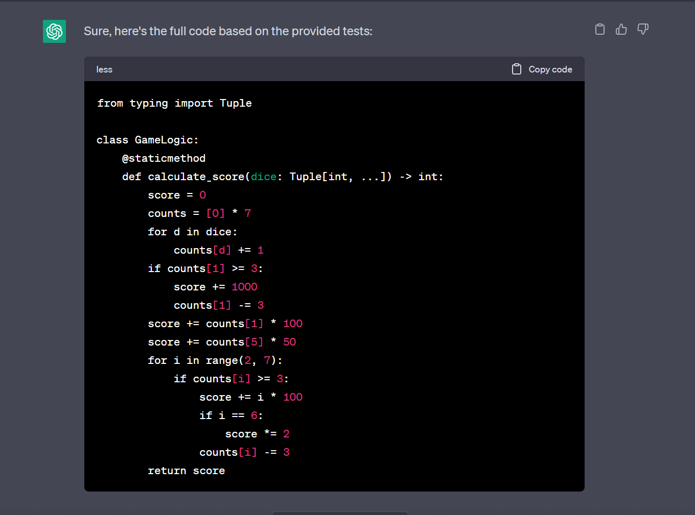
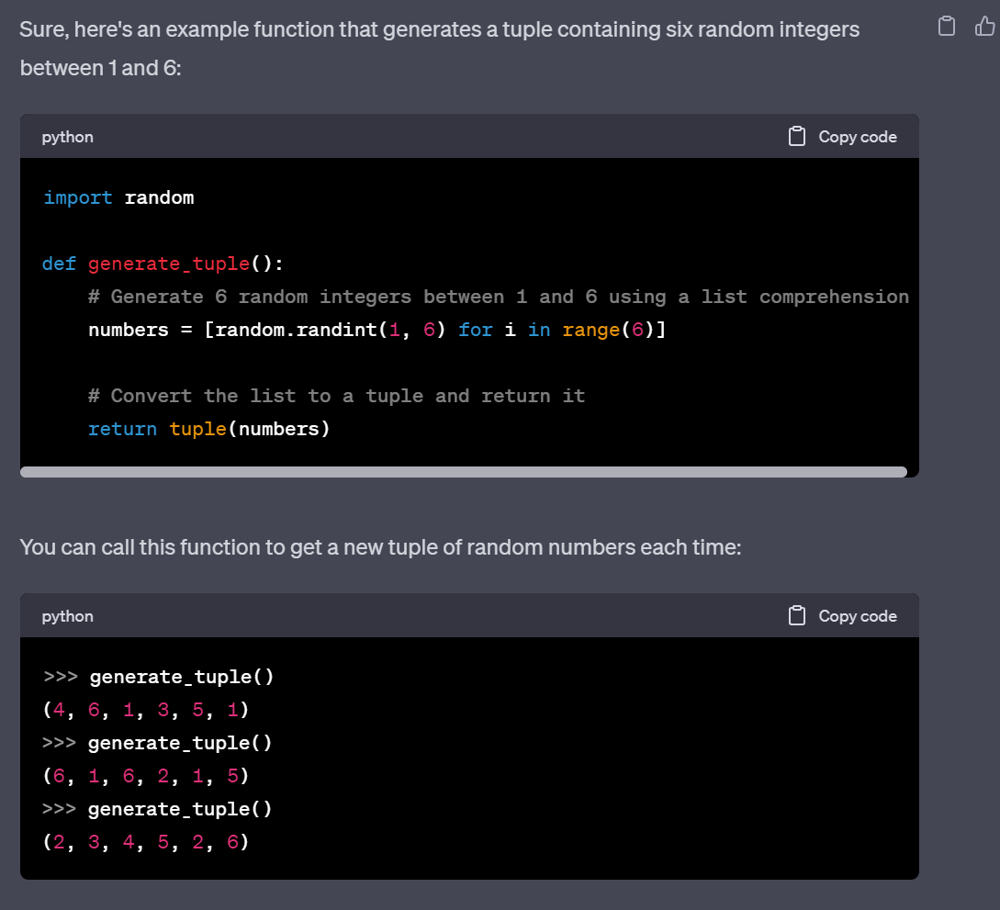

# chatGPT

## The prompt that you used to generate code

1. ```can you write the full code passed on these testes "```
```tests file"```

2. ```give me a python3 function to generate a tuple that contains six random numbers from 1 to 6```

## The actual code you got from ChatGPT

## 1  



## 2


